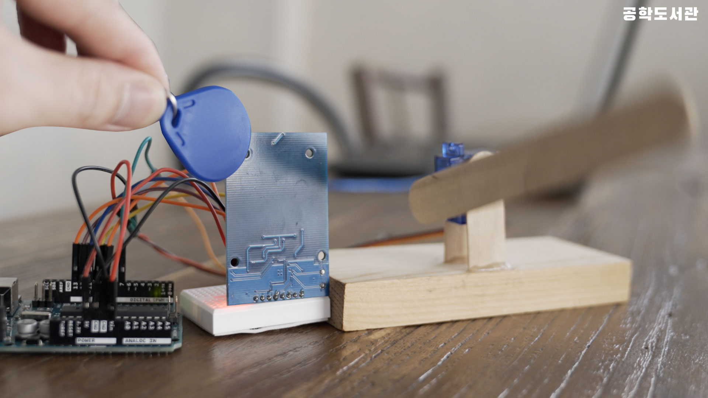
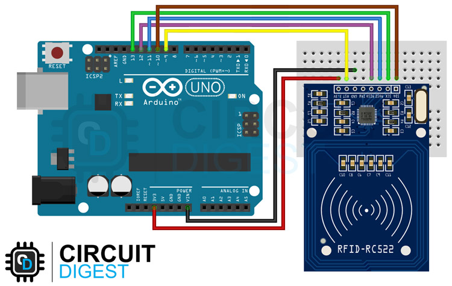

# 🎬 공학도서관 오리지널 컨텐츠

# 🚧 주차 차단기 만들기

## 📝 프로젝트 소개
이 프로젝트는 RFID 카드와 서보모터를 활용하여 나만의 주차 차단기를 만드는 과정을 설명합니다. 등록된 카드로만 열 수 있는 스마트한 차단기를 직접 만들어볼 수 있습니다.

## 📚 사전학습
이 프로젝트를 시작하기 전에 아래 내용을 먼저 공부하고 오시면 좋아요.

- 아두이노 기초
  - 아두이노 IDE 설치하기
  - SPI 통신 이해하기
  - 라이브러리 설치 방법 알아보기

- 전자부품 이해하기
  - RFID의 기본 개념 알아보기
  - 서보모터 제어 방법 이해하기
  - SPI 통신 핀 연결 방법 알아보기

- 프로그래밍 기초
  - 배열 다루기
  - 조건문 활용하기
  - 라이브러리 사용법 익히기

## 🎯 성취 목표
- RFID 모듈에서 카드 ID를 읽어올 수 있다.
- 읽어온 카드 ID를 프로그램에 등록할 수 있다.
- 등록된 카드를 인식하여 서보모터를 제어할 수 있다.
- 미등록 카드와 등록 카드를 구분할 수 있다.
- SPI 통신을 사용하여 모듈을 제어할 수 있다.

## 🛠 준비물
- 아두이노 우노 보드
- RFID-RC522 모듈
- RFID 카드
- 서보모터
- 브레드보드
- 점퍼선
- USB 케이블

## 📋 회로 연결 방법

### RFID 모듈 연결
| Arduino UNO | RFID-RC522 |
|------------|------------|
| 10         | SDA        |
| 13         | SCK        |
| 11         | MOSI       |
| 12         | MISO       |
| 9          | RST        |
| 5V         | VCC        |
| GND        | GND        |

### 서보모터 연결
| Arduino UNO | 서보모터 |
|------------|---------|
| 7          | 신호선(노란색) |
| 5V         | VCC(주황색)  |
| GND        | GND(갈색)   |

> **주의**: 회로 연결 시 반드시 아두이노의 전원을 끄고 진행하세요!

## 💾 실습 코드
| 파일명 | 설명 |
|--------|------|
| [RFID_ReadTagID.ino](./src/RFID_ReaDTagID/RFID_ReaDTagID.ino) | RFID 카드 ID 읽기 코드 |
| [RFID_Servo.ino](./src/RFID_Servo/RFID_Servo.ino) | 차단기 제어 코드 |

## 💻 주요 함수 설명
1. `rfid.PICC_IsNewCardPresent()`
   - 새로운 카드 감지 확인
   - 카드가 감지되면 true 반환

2. `rfid.PICC_ReadCardSerial()`
   - 카드의 시리얼 번호 읽기
   - 성공적으로 읽으면 true 반환

## ➡️ 순서도
1. RFID 모듈에서 카드 ID 읽기 ➡️ 
2. 읽은 ID와 등록된 ID 비교 ➡️ 
3. 일치하면 서보모터 90도 회전

## 🚀 시작하기
1. 회로를 제시된 대로 연결
   - RFID 모듈 SPI 핀 연결
   - 서보모터 연결

2. RFID 카드 등록하기
   - RFID_ReadTagID 코드 업로드
   - 카드 ID 확인 및 복사
   - RFID_Servo 코드에 ID 입력

3. 차단기 코드 업로드하기
   - RFID_Servo 코드 업로드
   - 서보모터 동작 확인

4. 동작 테스트
   - 등록된 카드로 테스트
   - 미등록 카드로 테스트

## 🔍 문제해결
- RFID 카드가 인식되지 않아요
  - RFID 모듈의 SPI 연결이 올바른지 확인해보세요.
  - 카드를 모듈에 더 가까이 대보세요.

- 서보모터가 움직이지 않아요
  - 서보모터의 전원 연결을 확인해보세요.
  - 신호선이 7번 핀에 제대로 연결되었는지 확인해보세요.

- 등록한 카드가 작동하지 않아요
  - 카드 ID가 정확히 복사되었는지 확인해보세요.
  - ID 배열의 순서가 맞는지 확인해보세요.

## 🌟 이렇게 업그레이드 해볼 수 있어요
- LCD로 상태를 표시해볼까요?
  "출입 허가", "출입 불가" 등을 화면에 표시할 수 있어요.

- 비밀번호도 추가해볼까요?
  카드 인식과 함께 키패드로 비밀번호를 입력하게 할 수 있어요.

- 출입 기록을 저장해볼까요?
  SD카드 모듈을 추가하여 언제 누가 출입했는지 기록할 수 있어요.

## 📚 참고 자료
- [MFRC522 라이브러리 문서](https://github.com/miguelbalboa/rfid)
- [서보모터 라이브러리 문서](https://www.arduino.cc/reference/en/libraries/servo/)
